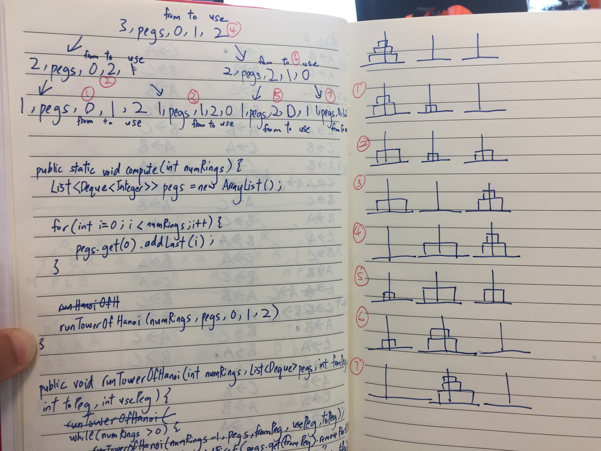

# Chapter 16: Recursion

- [x] 16.1 TowersOfHanoi ✅1
- [x] 16.2 NQueens ✅1
- [ ] 16.3 GeneratePermutations
- [ ] 16.4 GeneratePowerSet
- [ ] 16.5 GenerateSubsetsK
- [ ] 16.6 GenerateStrings
- [ ] 16.7 GeneratePalindromicDecompositions
- [ ] 16.8 GenerateBinaryTrees
- [ ] 16.9 SudokuSolver
- [ ] 16.10 ComputeGrayCode
- [ ] 16.11 ComputeDiameter

## 16.1 TowersOfHanoi

